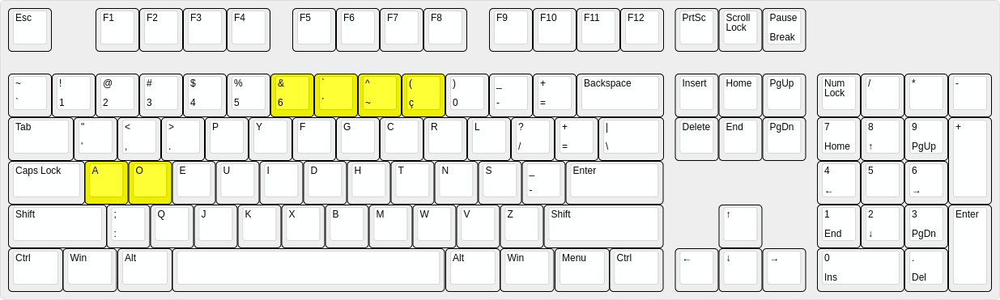
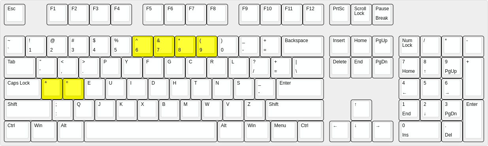

# usdvorak - Teclado Dvorak para digitar em português baseado no Dvorak US.


Estes arquivos contém as mudanças necessárias para digitar em português
com mudanças mínimas no layout dvorak US padrão.

# Exemplo ilustrativo

É fácil perceber as vantagens deste layout através de dois exemplos.

O primeiro exemplo é digitar a palavra __coração__. 
A principal vantagem deste layout é para digitar palavras que terminam em __ção__.

1. As teclas __c__, __o, __r, __a__ se mantêm iguais no dvorak internacional e neste layout.
2. Para digitar o __ç__, basta apertar a tecla __9__.
3. Para digitar o __ã__, basta apertar a tecla __8__ e em seguida o __a__.
3. Para digitar o __o__, se mantêm igual ao dvorak internacional.

O que é importante notar neste exemplo é que para digitar o __çã__ não é necessário deslocar a mão de posição,
como normalmente aconteceria. Além disso, o __ç__ e o __~__ são posicionados convenientemente um do lado do outro.

O segundo exemplo é digitar a palavra __sofá__.
A segunda vantagem deste layout é para digitar o acento agudo.

1. O __sof__ se mantém igual.
2. Para digitar o __á__, se aperta o __7__ e depois o __a__.

O que é importante notar neste segundo exemplo é que para digitar a tecla __´__ não é necessário
deslocar as mãos de posição, além de que se usa o indicador.

# Análise detalhada das mudanças

Esta imagem mostra o layout em questão:


Esta imagem mostra o layout quando se aperta a tecla Alt direita.


Em amarelo estão as teclas que são diferentes do teclado dvorak us padrão.
Como pode-se ver, apenas as teclas __6__, __7__, __8__ e __9__ foram realmente alteradas, enquanto as teclas __a__ e __o__
apenas receberam um atalho para se digitar o __ª__ e o __º__.

Como se pode ver, a acentução em português fica de fácil acesso, em alternância.
Em contrapartida, as teclas numéricas __7__, __8__ e __9__; e os símbolos __^__ e __*__ estão 
um pouco mais difícil de alcançar.

# Instalação

```
$ cp br /usr/share/X11/xkb/symbols/br
$ cp evdev.xml /usr/share/X11/xkb/rules/evdev.xml
```

# Uso

Depois disso, o teclado ficará disponível através do comando:

```
$ setxkbmap br -variant usdvorak
```
